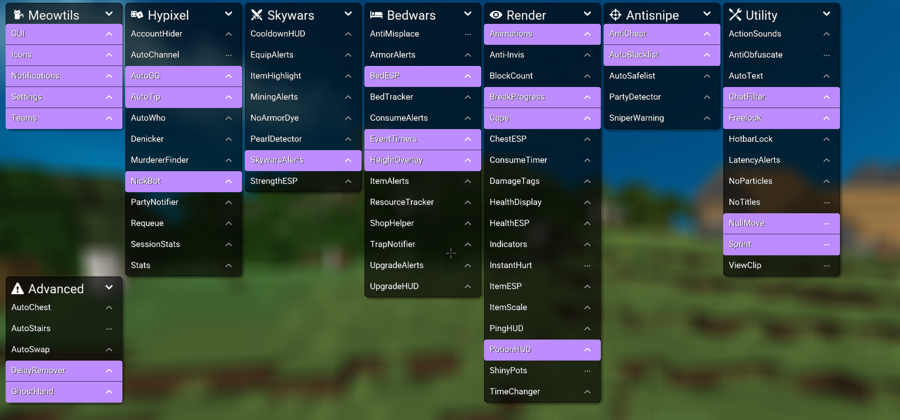

# What is Meowtils?

**Meowtils** is a client-side Fabric utility mod for **Minecraft 26.2**. This is the modern port of Meowtils 2.0.1: the same modules, Click GUI, commands, and extension API, rebuilt on named 26.2 APIs instead of Forge 1.8.9.

## This version

This documentation is for **[brrock/meowtils-modern](https://github.com/brrock/meowtils-modern)**. Versioning starts at `0.0.0`. Releases and auto-updates come from that GitHub repository.

It is **not** the old Forge 1.8.9 / Lunar Client build at `femboytatp/meowtils`. Those jars will not load here.

!!! Warning "Download only from GitHub"

    The only official download for this port is [github.com/brrock/meowtils-modern/releases](https://github.com/brrock/meowtils-modern/releases/latest).

## Supported versions

- [x] **Minecraft 26.2**
- [x] **Fabric Loader 0.19.3+**
- [x] **Fabric API 0.154.0+26.2**
- [x] **Java 25**

- [ ] Forge 1.8.9
- [ ] Lunar Client 1.8.9
- [ ] ViaFabricPlus on the client

For Hypixel and other 1.8.9-style servers, use **server-side** ViaVersion or ViaProxy. Do not put ViaFabricPlus in the client mods folder.

[Installation guide](guides/installation.md)

## Supported platforms

- [x] Windows
- [x] Linux
- [x] macOS

Use any launcher that can run a Fabric 26.2 instance. [Prism Launcher](https://prismlauncher.org/) is the usual path.

## Features

- **79 modules** for Hypixel, Bedwars, Skywars, render, utility, and QOL
- **In-game stats** from Abyss or the Hypixel API
- **Client-side anticheat** flags for nearby players
- **Personal lists** (blacklist, safelist, friends)
- **Original commands** (`/meow`, `/s`, `/rq`, `/reload`, …) — there is no `/meowtils` tree
- **Extensions** — load your own `.meowtils` archives at runtime
